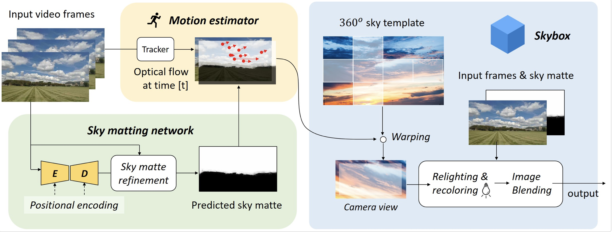

# AI-Based Sky Replacement
[SkyAR](https://arxiv.org/abs/2010.11800)
* Dr. Károly Zsolnai-Fehér - AI-based sky Replacement
* Given a video input based in a certain situation, the algorithm will rerender and output a new version in a different simulated condition
    * For example, given a day time video -> the same video will be rerendered in nightime conditions - even accounting for appropriate reflections on car hoods and such
* The general premise of this paper with video replacement was accomplished 3 years ago - however, there were lots of artifacts and heavy gaps between frames 
* The biggest changes are as follows: 
    1. Sky can be easily substituted with elements in the sky 
    2. Elements that are in the replaced sky move in harmony or relative to the scene as well - not stationary
    3. The relative colour change is reflected in the rest of the scene 
        * This general adapatability also transcends to dynamic backgrounds 
* The expectations of the algorithm are as follows: 
    1. Being aware of the pixels that need to be loaded as a different colour
    2. Understand how the image changes over time
    3. Recolouring has to take place

* The predicted sky matter is responsible for finding the parts of the image that contains sky 
* The motion estimator computes the optical flow of the image, tracks the movement of the sky over time 
* The Recolouring module is also featured

* Not only can it replace the sky, but also detailed whether and lighting synthesis 
